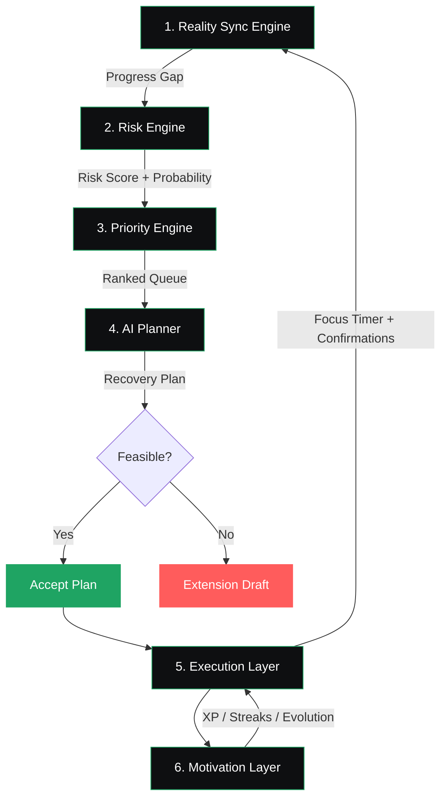

# FocusForge AI — Reality Sync & Predictive Productivity

<div align="center">

</div>

<div align="center">


<br/>

<a href="https://ais-pre-46ukfrdkg45euwwong2asx-480780234318.asia-southeast1.run.app">
  
</a>


<br/><br/>


</div>

<br/>

> **Every other productivity app tracks whether you obeyed it. FocusForge tracks whether your life actually moved forward — and fixes the gap when it doesn't.**

Most apps assume their plan *is* reality. FocusForge doesn't. It reconciles what you said you'd do against what your Focus Timer and your own honesty say actually happened — then calculates real deadline risk from that gap, and proactively tries to fix it before you ever miss a deadline.

<br/>

<div align="center">

</div>

<br/>

## 🧠 The Six-Layer Architecture



| Layer | Answers |
|---|---|
| 🔍 **Reality Sync** | "How far behind reality am I?" |
| 🚨 **Risk Engine** | "What are the real odds I miss this?" |
| 📊 **Priority Engine** | "Out of everything, what do I do first?" |
| 🤖 **AI Planner** | "Can this still be saved — and if not, help me ask for more time." |
| ⏱ **Execution Layer** | "Prove it. Log it." |
| 🏆 **Motivation Layer** | "Here's the receipt for your real progress." |

<br/>

## ⚖️ Why FocusForge?

| ❌ Without FocusForge | ✅ With FocusForge |
|---|---|
| You mark a task done... or forget to. The app has no idea which. | Before judging you, it asks: *"Did this really happen?"* |
| Miss your planned start time, and the rest of your day just sits there, wrong. | One missed block triggers **Cascade Recovery** — your whole day reflows automatically. |
| Red alerts everywhere, with no real plan to fix anything. | **Recovery Plan** tries to save the deadline first. Only suggests an extension if the math genuinely doesn't work. |
| Streaks break because you forgot to check a box — not because you actually failed. | **Forgiveness Window** protects your streak. Honesty matters more than perfect logging. |
| Generic countdowns that don't know how you actually work. | **Risk Score** factors in *your* personal historical pace — not a one-size-fits-all timer. |
| Team leaderboards rank you by how much you did. | **Reliability Score** ranks you by how well your word matched your output. |

<br/>

## ✨ Features

### 🤖 AI & Intelligence
* ⚡ **Reality Sync** — Reconcile plans against actual logged action
* 🚨 **Risk Center** — Predictive deadline-miss risk calculation
* 🛠️ **Recovery Missions** — AI auto-reflow and extension drafts
* 🤖 **AI Command Center** — Natural language interface for quick actions
* 💬 **AI Chat Assistant** — Interactive support & scheduling coach
* 🎙️ **Voice Input (Speech-to-Text)** — Quick task & note dictation
* 🔊 **AI Voice Responses (Text-to-Speech)** — Audio narration & coaching feedback

### 📝 Task Management
* 📝 **Smart Task Creation** — Quick, natural entries
* ✏️ **Edit & Delete Tasks** — Effortless management
* 📌 **Pin Tasks** — Pin critical quests to the dashboard
* ✅ **Mark Complete** — Instantly record achievements
* 📋 **Task Details Panel** — Rich metadata & checklist subtasks
* 🎯 **Priority Management** — Critical / High / Medium / Low options

### 📅 Calendar & Scheduling
* 📅 **Calendar Integration** — Visual drag-and-drop planning
* 🖱️ **Drag & Drop Scheduling** — Move and reschedule blocks with ease
* 📆 **Multi-View Support** — Day / Week / Month / Year displays

### 🍅 Focus & Execution
* 🍅 **Pomodoro Focus Timer** — Immersive focused work cycles
* ⏸️ **Pause & Resume** — Handles real-world interruptions smoothly
* 🪟 **Floating Focus Timer** — Draggable widget visible across sections
* 📌 **Edge-Docking Bubble** — Collapse to elegant, space-saving Messenger-style bubbles

### 🎮 Progression & Social
* 🎮 **XP & Progression** — Dynamic leveling based on focused execution
* 👤 **Character Evolution** — Custom avatar profiles reflecting real-life progress
* 🏆 **Leaderboard** — Compete on actual **Reliability Score**, not overworking

### 📊 Insights & Analytics
* 📊 **Productivity Dashboard** — Command center overview of current metrics
* 📈 **Analytics & Insights** — Beautiful D3 charts tracking focus history & risk curves

### 🎨 Platform & Polish
* 🌞 **Light & 🌙 Dark Theme** — Eye-friendly themes for day/night coding
* 🔐 **Authentication** — Secure login via email or Google providers
* 📱 **Fully Responsive** — Perfect layouts on mobile, tablet, and desktop
* 🎯 **Interactive Onboarding** — Walkthrough onboarding to welcome new users
* 🔄 **Replay Product Tour** — Reset and re-run tutorials anytime
* 🎨 **Premium Glassmorphism** — Gorgeous, high-contrast, modern layout aesthetics
* ✨ **Animated RGB Effects** — Subtle visual accents celebrating high-achievement states
* 🔔 **Smart Productivity Notifications** — Real-time alerts keeping you synchronized

<br/>

## 🎬 See It In Action

<div align="center">


<br/><br/>

<!-- 🎥 Replace with an actual screen recording GIF of the live demo before submission -->


</div>

<br/>

## 🛠 Tech Stack

<div align="center">


</div>

<br/>

## 🚀 Run and Deploy Your AI Studio App

This contains everything you need to run your app locally.

**View your app in AI Studio:** [Click Here](https://ais-pre-46ukfrdkg45euwwong2asx-480780234318.asia-southeast1.run.app)

### Run Locally

**Prerequisites:** Node.js

1. Install dependencies:
   ```bash
   npm install
   ```
2. Set the `GEMINI_API_KEY` in `.env` to your Gemini API key
3. Run the app:
   ```bash
   npm run dev
   ```

<br/>

## 🗂 Sidebar / Page Map

```
🏠 Dashboard          — your AI Coach, today's priority queue, risk overview
🎯 Quests             — task management, AI-suggested importance
👥 Workspaces         — team Reality Sync, Reliability Score, AI Blocker Detection
🧠 Reality Sync       — the plan-vs-reality reconciliation engine
🚨 Risk Center        — every Yellow/Red task, ranked
🎯 Recovery Missions  — AI recovery plans → extension drafts, only if truly infeasible
⏱ Training           — Focus Timer, feeds Reality Sync live
📅 Calendar           — plan vs. reality, visualized
🏆 Leaderboard        — ranked by Reliability, not just raw output
👤 Character          — the receipt for your real progress, not the point
```

<br/>

## 🤝 Built For

<div align="center">

**Coding Ninjas × Google for Developers — VIBE2SHIP Hackathon**


</div>
